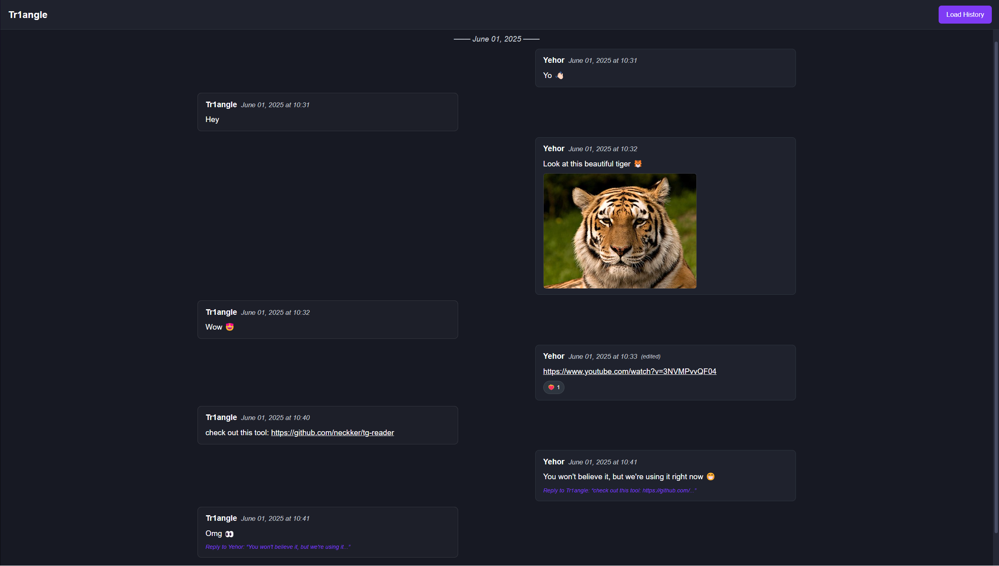

# tg-reader



tg-reader is a lightweight, browser-based Telegram chat viewer designed to load and display large chat histories directly from the `result.json` export file (no HTML exports required). It offers a clean, dark-themed interface and supports pagination, date separators, media playback, reactions, and inline replies.

## Features

- **Load Local JSON**  
  Simply click “Load History” and select your `result.json` export file. No server or external dependencies required.

- **Dark Theme & Responsive Layout**  
  Built with Tailwind CSS for a modern, dark-themed UI. Message containers are limited to a comfortable max-width (`max-w-7xl`) and automatically adapt to various screen sizes.

- **Pagination**  
  Chat histories with thousands (or hundreds of thousands) of messages are split into pages of 200 messages each. Navigate through pages with “Previous Page” / “Next Page” buttons. When moving forward, the view scrolls to the top; when moving backward, your scroll position is preserved for continuous reading.

- **Date Separators**  
  Messages are grouped by date. Whenever the date changes, a separator line appears:

## Installation & Usage

1. **Clone or Download**  
```bash
git clone https://github.com/neckker/tg-reader.git
cd tg-reader
```

2. **Open in Browser**  
Open `index.html` in any modern browser (Chrome, Firefox, Edge, Safari).

3. **Load Your Telegram History**
Click **Load History** in the top header.
Select the `result.json` file generated by Telegram’s “Export Chat History” feature.

4. **Navigate Messages**
Use “Previous Page” / “Next Page” at the bottom to move through pages of messages.
Click “Reply to …” to jump to the original message (it will be highlighted briefly).
Scroll manually within each page to read messages.

## File Structure
```graphql
tg-reader/
├── assets/
│   └── preview.png        # Preview screenshot shown above
├── index.html             # Main HTML file
├── app.js                 # Core JavaScript logic (parsing, rendering, pagination)
├── worker.js              # Web Worker for parsing large JSON without freezing UI
├── README.md              # This file
└── styles.css (optional)  # Additional custom styles (if any)
```

## License
This project is licensed under the MIT License. Feel free to fork, modify, and redistribute.
